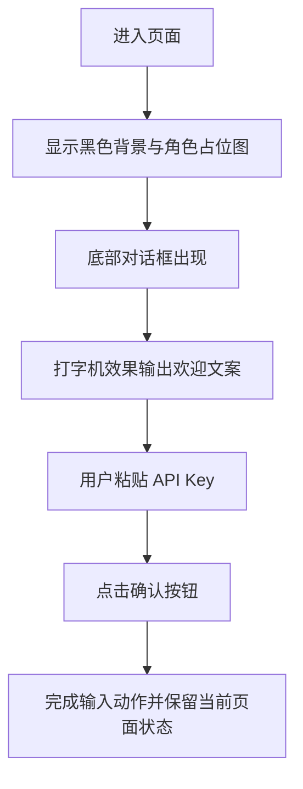

## 1. 产品概述

这是一个单页面 React 应用，模拟经典视觉小说（Galgame）对话界面，引导用户在沉浸式黑场中输入并提交 API Key。

* 核心目标是用极简、赛博朋克、强氛围的交互界面承载一次明确的输入动作，降低认知噪音，强化“进入系统”的仪式感。

* 页面面向刚获取 API Key 的用户，强调情绪引导、视觉记忆点和清晰的单步操作。

## 2. 核心功能

### 2.1 功能模块

1. **主页面**：全黑背景、极简角色占位图、对话框容器、输入交互区。
2. **对话文本模块**：以打字机效果输出固定文案“欢迎来到真实世界。把你刚刚获取的 API Key 粘贴在这里。”
3. **输入确认模块**：提供极简输入框、发光确认按钮，以及基础的输入状态反馈。

### 2.2 页面细节

| 页面名称 | 模块名称  | 功能描述                                        |
| ---- | ----- | ------------------------------------------- |
| 主页面  | 背景层   | 采用纯黑基底和极轻量的赛博光晕，营造深空、终端、夜景式氛围               |
| 主页面  | 角色占位图 | 在屏幕中央偏左展示极简 2D 人物轮廓，占位图不喧宾夺主，但必须具备视觉小说角色存在感 |
| 主页面  | 对话框   | 固定于底部，半透明黑色材质，具有细边框和柔和发光效果                  |
| 主页面  | 打字机文字 | 页面加载后逐字输出欢迎文案，支持光标闪烁和自然停顿                   |
| 主页面  | 输入框   | 提供单行 API Key 输入，风格克制、聚焦态清晰、与整体配色一致          |
| 主页面  | 确认按钮  | 明确可点击，具备发光边缘和悬停反馈，形成页面唯一主操作焦点               |

## 3. 核心流程

用户进入页面后，首先看到黑场中的角色与底部对话框；系统开始逐字输出提示文案；文案完成后，用户将 API Key 粘贴到输入框中，并点击确认按钮完成输入动作。

## 4. 用户界面设计

### 4.1 设计风格

* 主色：纯黑、烟黑、低饱和冷灰

* 强调色：霓虹青蓝，用于按钮光效、聚焦边缘和少量高亮文本

* 按钮风格：细边框、轻量发光、无厚重拟物效果

* 字体建议：标题与大字使用具有未来感的窄体或工业感字体，正文使用清晰的无衬线字体

* 布局风格：全屏沉浸式构图，角色偏左，对话框贴底，信息层次极少但聚焦明确

* 图形建议：避免复杂插画，角色占位图使用轮廓线、几何切面、微弱辉光完成表达

### 4.2 页面设计概览

| 页面名称 | 模块名称  | UI 元素                   |
| ---- | ----- | ----------------------- |
| 主页面  | 场景背景  | 纯黑基底、轻微径向渐变、极淡网格或扫描线纹理  |
| 主页面  | 角色占位图 | 极简 2D 剪影、几何发丝与肩线、冷色轮廓光  |
| 主页面  | 对话框   | 半透明黑面板、细线边框、背景模糊、上缘微光   |
| 主页面  | 对话文本  | 打字机动画、闪烁光标、较高字距与呼吸感排版   |
| 主页面  | 输入区   | 低对比输入框、清晰焦点环、按钮与输入框统一高度 |
| 主页面  | 动效    | 首屏淡入、文字逐字出现、按钮悬停发光增强    |

### 4.3 响应式设计

* 采用桌面优先设计，首先确保桌面端视觉小说构图成立

* 在窄屏下角色缩小并略向上移动，对话框保持底部满宽

* 输入区在移动端可垂直堆叠，确保输入与确认操作始终清晰可见

