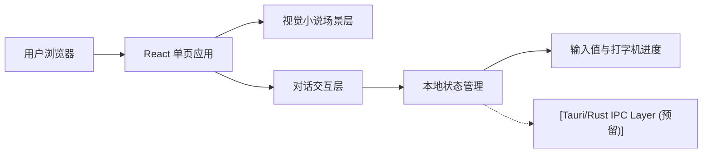

## 1. 架构设计


## 2. 技术说明
- 前端：React 18 + TypeScript + Tailwind CSS 3 + Vite
- 初始化方式：`vite-init`
- 状态管理：Zustand，用于管理 API Key 输入值、打字机动画状态和确认反馈
- 样式策略：Tailwind 工具类结合少量全局样式变量，统一黑场、霓虹边框和材质效果
- 动效方案：原生 CSS 动画与 React 定时逻辑组合实现淡入、呼吸光和打字机效果

## 3. 路由定义
| 路由 | 用途 |
|------|------|
| / | 视觉小说式 API Key 输入主页面 |

## 4. API 定义
当前阶段不接入后端 API。

前端状态类型定义：

```ts
type SceneState = {
  apiKey: string
  typedText: string
  systemResponse: string // 预留给将来 CLI 返回的文字
  isTypingComplete: boolean
  isSubmitted: boolean
  isLoading: boolean // 模拟连接过程的加载状态
}
```

交互事件定义：

```ts
type SceneActions = {
  setApiKey: (value: string) => void
  advanceTyping: (value: string) => void
  finishTyping: () => void
  submit: () => void
  handleSystemResponse: (response: string) => void // 处理未来 Tauri 传回的消息
}
```

## 5. 页面模块划分
| 模块 | 职责 |
|------|------|
| `src/pages/HomePage.tsx` | 组织页面场景结构，串联角色、对话框和输入区 |
| `src/components/CharacterSilhouette.tsx` | 渲染极简 2D 角色占位图与氛围光效 |
| `src/components/DialogPanel.tsx` | 渲染底部对话框、文案区、输入区与确认按钮 |
| `src/hooks/useTypewriter.ts` | 管理逐字输出逻辑、延迟与结束状态 |
| `src/store/useSceneStore.ts` | 维护输入值与提交状态 |

## 6. 数据模型
### 6.1 数据模型定义
本项目仅包含前端临时状态，不需要数据库或持久化数据表。

### 6.2 状态字段说明
| 字段 | 类型 | 说明 |
|------|------|------|
| `apiKey` | `string` | 用户当前输入的 API Key |
| `typedText` | `string` | 当前已输出的文案片段 |
| `systemResponse` | `string` | 系统返回的消息文本（为 Tauri 预留） |
| `isTypingComplete` | `boolean` | 打字机动画是否完成 |
| `isSubmitted` | `boolean` | 用户是否点击确认 |
| `isLoading` | `boolean` | 提交后的加载连接状态 |

## 7. 实现约束
- 只实现单页面，不引入多余导航、页签或营销型内容
- 背景必须保持黑色主导，不允许出现破坏氛围的大面积高亮块
- 角色占位图使用 CSS 与 HTML 结构绘制，不依赖外部图片资源
- 确认按钮必须有明确发光反馈，但整体仍需保持极简克制
- 所有交互文本与界面文案使用中文，符合当前需求语境
