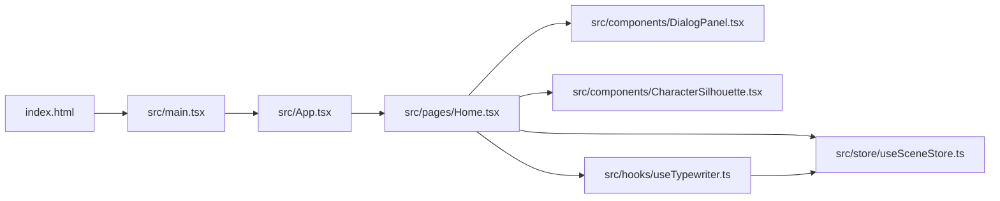
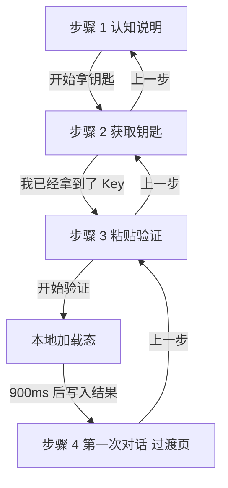

# 01. 项目总览

## 1. 项目定位

`Code Like Game` 是一个前端单页原型项目，用“视觉小说 / 游戏第一关”的方式承载 AI Coding 新手入门流程。它不是通用官网，也不是完整教学平台，而是一个强调低干扰、强氛围、单目标推进的引导式交互原型。

当前版本的唯一核心闭环是：

- 帮用户理解“先拿到 API Key，再开始 AI Coding”
- 引导用户前往 DeepSeek 开放平台获取 Key
- 返回页面粘贴 Key
- 在前端本地模拟一次“链路验证成功”

## 2. 当前能力边界

### 已实现

- 单页沉浸式黑场 UI
- 四步式新手引导流程
- 打字机式文案输出
- API Key 输入与本地校验提示
- 模拟验证成功后的结果展示
- 支持 `上一步` 回退
- 基础单元测试

### 未实现

- 真实联网请求 DeepSeek 或其他模型服务
- 后端 API、数据库、鉴权体系
- 多页面路由、多关卡任务系统
- 环境变量驱动的外部配置
- 生产部署脚本、Docker、CI/CD 流程

## 3. 技术栈

| 分类 | 技术 |
| --- | --- |
| 前端框架 | `React 18` |
| 语言 | `TypeScript` |
| 构建工具 | `Vite 6` |
| 路由 | `react-router-dom` |
| 状态管理 | `Zustand` |
| 样式 | `Tailwind CSS` + 全局 CSS |
| 测试 | `Vitest` + `@testing-library/react` + `jsdom` |
| 代码规范 | `ESLint 9` + `typescript-eslint` |

## 4. 目录结构

```text
workspace/
├── public/
│   └── favicon.svg
├── src/
│   ├── assets/
│   │   └── react.svg
│   ├── components/
│   │   ├── CharacterSilhouette.tsx
│   │   ├── DialogPanel.tsx
│   │   └── Empty.tsx
│   ├── hooks/
│   │   ├── useTheme.ts
│   │   └── useTypewriter.ts
│   ├── lib/
│   │   └── utils.ts
│   ├── pages/
│   │   ├── Home.test.tsx
│   │   └── Home.tsx
│   ├── store/
│   │   └── useSceneStore.ts
│   ├── test/
│   │   └── setup.ts
│   ├── App.tsx
│   ├── index.css
│   ├── main.tsx
│   └── vite-env.d.ts
├── .trae/
│   └── documents/
│       ├── 产品需求文档.md
│       └── 技术架构文档.md
├── README.md
├── eslint.config.js
├── index.html
├── package.json
├── postcss.config.js
├── tailwind.config.js
├── tsconfig.json
└── vite.config.ts
```

## 5. 核心运行链路

应用从浏览器入口到业务页的链路非常短，便于理解：



对应职责如下：

- `index.html`：提供挂载点 `#root`
- `src/main.tsx`：创建 React 根节点并加载全局样式
- `src/App.tsx`：定义浏览器路由，当前仅暴露 `/`
- `src/pages/Home.tsx`：组装页面、读取状态、驱动模拟验证
- `src/components/DialogPanel.tsx`：渲染交互面板与步骤内容
- `src/components/CharacterSilhouette.tsx`：负责角色剪影氛围图
- `src/hooks/useTypewriter.ts`：负责逐字输出动效
- `src/store/useSceneStore.ts`：承载全局流程状态

## 6. 业务主流程

当前主流程可视为一个 4 步有限状态流程：



这个流程说明了两个关键事实：

- 流程控制目前完全在前端完成，没有后端参与。
- 第 4 步本质上仍是“完成页 / 过渡页”，不是完整的下一关任务。

## 7. 核心文件速查

| 文件 | 用途 |
| --- | --- |
| `src/main.tsx` | React 应用挂载入口 |
| `src/App.tsx` | 路由入口 |
| `src/pages/Home.tsx` | 主流程编排、状态读取、模拟验证触发 |
| `src/components/DialogPanel.tsx` | 引导面板、输入区、步骤 UI |
| `src/components/CharacterSilhouette.tsx` | 角色剪影视觉层 |
| `src/store/useSceneStore.ts` | 全局状态与行为动作 |
| `src/hooks/useTypewriter.ts` | 打字机效果 Hook |
| `src/pages/Home.test.tsx` | 核心流程测试 |
| `vite.config.ts` | Vite 与 Vitest 配置 |
| `tsconfig.json` | TS 编译选项与路径别名 |

## 8. 阅读建议

如果是第一次接手仓库，建议按如下顺序读代码：

1. `src/pages/Home.tsx`
2. `src/store/useSceneStore.ts`
3. `src/components/DialogPanel.tsx`
4. `src/hooks/useTypewriter.ts`
5. `src/pages/Home.test.tsx`

这样能先理解主流程，再补齐状态与交互细节。
