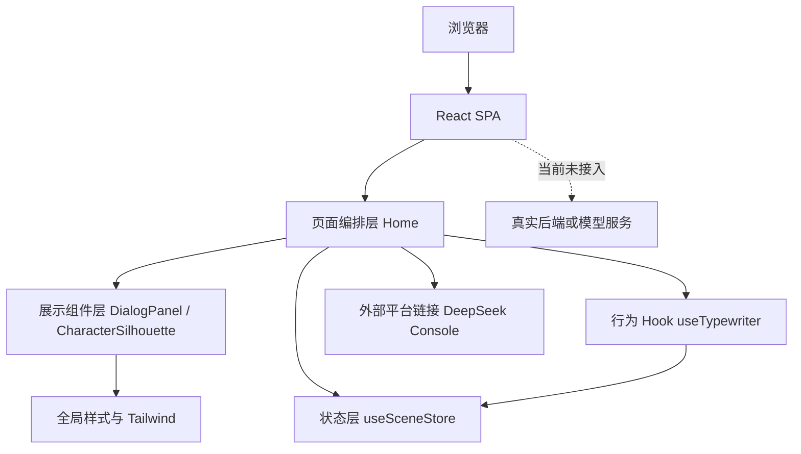
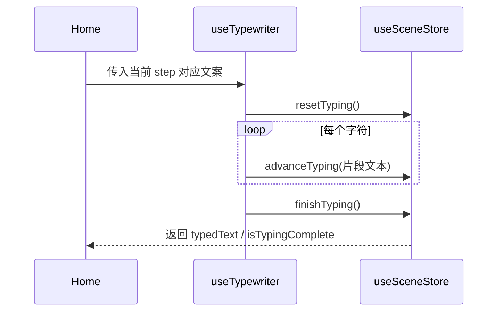
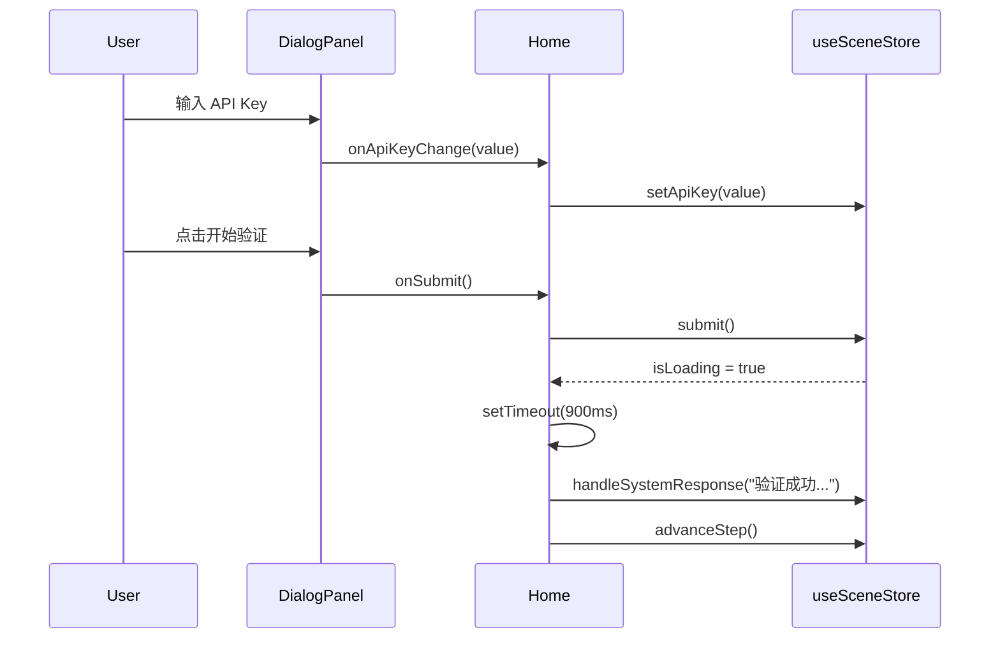

# 02. 架构设计

## 1. 架构概览

当前系统是一个纯浏览器端运行的 React SPA，业务逻辑规模较小，采用“页面编排 + 展示组件 + Zustand 状态中心 + Hook 动效”的轻量架构。



## 2. 分层说明

### 2.1 应用入口层

- `src/main.tsx`
- `src/App.tsx`

职责：

- 创建 React 根节点
- 加载全局 CSS
- 建立浏览器路由

特点：

- 非常薄
- 无业务判断
- 路由规模当前只有一个页面

### 2.2 页面编排层

- `src/pages/Home.tsx`

职责：

- 作为主业务容器，串联角色区和对话区
- 读取 Zustand 中的全局流程状态
- 调用 `useTypewriter()` 生成打字机文本
- 在 `isLoading` 为 `true` 时，通过 `setTimeout` 模拟一次异步验证完成
- 把 store 中的动作和状态通过 props 传给 `DialogPanel`

特点：

- 是当前业务逻辑最集中的文件
- 同时承担“页面组合”和“流程调度”两类职责
- 后续若功能扩张，最先需要拆分的通常也是这里

### 2.3 展示组件层

- `src/components/DialogPanel.tsx`
- `src/components/CharacterSilhouette.tsx`
- `src/components/Empty.tsx`

职责：

- 负责 UI 呈现
- 接收上层传入的数据与事件
- 不直接发起网络请求

边界说明：

- `DialogPanel` 不直接访问 store，这使它仍保持为偏展示型组件
- `CharacterSilhouette` 是纯视觉组件，几乎没有业务复杂度
- `Empty` 当前未接入主流程，更像脚手架遗留占位组件

### 2.4 状态管理层

- `src/store/useSceneStore.ts`

职责：

- 存储流程步骤、输入内容、加载态、系统反馈、打字机进度
- 提供推进步骤、回退步骤、提交、重置打字机等动作

架构价值：

- 让页面与 Hook 共用一份中心状态
- 避免逐层 props 传递过多中间态
- 对当前规模来说足够轻量

### 2.5 行为 Hook 层

- `src/hooks/useTypewriter.ts`
- `src/hooks/useTheme.ts`

职责：

- `useTypewriter`：驱动逐字输出
- `useTheme`：读写主题状态与 `localStorage`

边界说明：

- `useTypewriter` 已接入主流程，是关键行为模块
- `useTheme` 尚未被业务页面使用，属于预备能力

## 3. 状态模型

当前主要状态都在 `useSceneStore` 中定义。

### 3.1 状态字段

| 字段 | 类型 | 含义 |
| --- | --- | --- |
| `step` | `1 | 2 | 3 | 4` | 当前所在步骤 |
| `apiKey` | `string` | 用户输入的 API Key |
| `typedText` | `string` | 当前已逐字渲染的文本 |
| `systemResponse` | `string` | 系统反馈语句 |
| `isTypingComplete` | `boolean` | 当前段落打字机是否结束 |
| `isSubmitted` | `boolean` | 是否已触发提交 |
| `isLoading` | `boolean` | 是否处于模拟验证中 |

### 3.2 状态动作

| 动作 | 作用 |
| --- | --- |
| `advanceStep()` | 前进一步，最大不超过 4 |
| `retreatStep()` | 后退一步，最小不低于 1 |
| `setApiKey(value)` | 写入输入值，并重置部分提交流程状态 |
| `advanceTyping(value)` | 更新当前逐字文本 |
| `finishTyping()` | 标记打字机输出完成 |
| `submit()` | 执行本地输入校验并进入加载态 |
| `handleSystemResponse(response)` | 写入系统反馈并结束加载态 |
| `resetTyping()` | 重置逐字文本和完成状态 |

## 4. 核心状态流

### 4.1 打字机状态流



说明：

- 打字机状态实际被存放在 store，而不是 Hook 本地状态中。
- 这样做的好处是状态可被页面其他部分共享。
- 代价是 `typedText` 成为全局状态的一部分，稍显“重”。

### 4.2 提交流程状态流



说明：

- `submit()` 本身不负责真实请求，只设置加载态与提示语。
- “验证成功”的异步完成逻辑写在 `Home.tsx` 的 `useEffect` 中。
- 这说明当前异步模型是“页面层模拟”，不是“数据服务层执行”。

## 5. 组件通信方式

当前通信方式非常直接：

- `Home` 直接读取 store
- `Home` 把状态与动作以 props 传给 `DialogPanel`
- `useTypewriter` 也直接读取与更新 store

优点：

- 简单
- 易于追踪
- 对小项目维护成本低

缺点：

- `Home` 逐渐变成“总调度器”
- 异步逻辑与 UI 编排耦合
- store 中混合了流程状态与动效状态

## 6. 依赖关系

### 6.1 运行时依赖关系

```text
Home
├─ 使用 useSceneStore
├─ 使用 useTypewriter
├─ 组合 DialogPanel
└─ 组合 CharacterSilhouette

DialogPanel
└─ 仅依赖父组件传入 props

useTypewriter
└─ 使用 useSceneStore 中的 typedText / isTypingComplete / resetTyping 等动作
```

### 6.2 配置依赖关系

- `vite.config.ts` 依赖 `@vitejs/plugin-react`
- `vite.config.ts` 依赖 `vite-tsconfig-paths` 提供 `@/*` 路径别名解析
- `vite.config.ts` 依赖 `vite-plugin-trae-solo-badge` 在生产构建中注入 Badge
- `tsconfig.json` 定义 `@/* -> ./src/*`

## 7. 架构约束

从现有代码和文档可归纳出以下约束：

- 项目优先服务单一新手引导场景，而非通用平台化系统
- 当前所有交互均以中文呈现
- 视觉基调固定为黑场、低亮度、霓虹冷色点缀
- 当前不接入后端，所有“验证”仅为前端模拟
- 角色图采用 CSS 结构绘制，不依赖外部图片素材

## 8. 现阶段架构风险

### 风险 1：页面层承担了异步编排职责

`Home.tsx` 中的 `useEffect + setTimeout` 适合原型，但不适合未来接入真实 API。真实请求加入后，页面层会快速变重。

### 风险 2：store 混合业务状态与表现状态

`typedText`、`isTypingComplete` 这类动效状态和 `apiKey`、`step` 这类业务状态放在一起，规模扩大后可能导致订阅边界不清晰。

### 风险 3：步骤定义散落

步骤文案在 `Home.tsx`，步骤标签与步骤内容在 `DialogPanel.tsx`，步骤切换规则在 `useSceneStore.ts`。后续若引入更多关卡，维护成本会上升。

### 风险 4：未使用代码开始出现

`useTheme.ts`、`Empty.tsx`、`lucide-react` 依赖目前都未在核心流程中使用，说明仓库已开始出现脚手架残留或未来预留代码。

## 9. 建议的后续架构演进

按当前代码规模，推荐演进方向如下：

1. 抽离 `flow` 或 `scenes` 配置，将步骤文案、状态标签、按钮文案集中声明。
2. 引入 `services` 或 `adapters` 层，承接未来真实 API / IPC / SDK 调用。
3. 将动画状态从业务 store 中拆分，或局部化到 Hook 内部。
4. 为每一关定义更明确的数据结构，而不是固定写死 4 个步骤。
5. 若后续接入 Tauri，再在边界层统一处理桌面能力，不让页面直接感知 IPC 细节。
