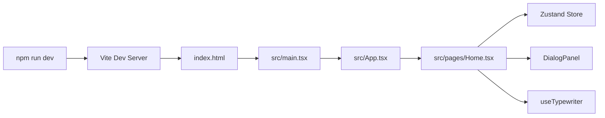

# 04. 依赖与运行

## 1. 运行环境

当前仓库是标准 Node.js 前端项目，主要依赖 npm 管理。

推荐环境：

- `Node.js 18+` 或更高版本
- `npm 9+`

仓库内当前没有：

- `.nvmrc`
- `.node-version`
- Docker 运行环境定义
- `.env` 示例文件

因此运行环境主要依赖本地 Node/npm 版本保持兼容。

## 2. 安装依赖

```bash
npm install
```

说明：

- 依赖由 `package-lock.json` 锁定
- 当前使用 npm，而不是 pnpm / yarn / bun

## 3. 常用命令

| 命令 | 实际脚本 | 用途 |
| --- | --- | --- |
| `npm run dev` | `vite` | 启动本地开发服务器 |
| `npm run build` | `tsc -b && vite build` | 先做 TS 构建检查，再生成生产构建 |
| `npm run preview` | `vite preview` | 本地预览构建产物 |
| `npm run check` | `tsc -b --noEmit` | 类型检查 |
| `npm run lint` | `eslint .` | 代码检查 |
| `npm run test` | `vitest run` | 运行测试 |

推荐本地开发顺序：

```bash
npm install
npm run dev
```

推荐提交前校验：

```bash
npm run check
npm run lint
npm run test
npm run build
```

## 4. 依赖说明

### 4.1 运行时依赖

| 依赖 | 用途 |
| --- | --- |
| `react` | UI 框架 |
| `react-dom` | 浏览器渲染 |
| `react-router-dom` | 浏览器路由 |
| `zustand` | 全局状态管理 |
| `clsx` | 条件类名拼接 |
| `tailwind-merge` | Tailwind 类名冲突合并 |
| `lucide-react` | 图标库，当前未使用 |

### 4.2 开发依赖

| 依赖 | 用途 |
| --- | --- |
| `vite` | 开发服务器与构建器 |
| `@vitejs/plugin-react` | React 支持 |
| `vite-tsconfig-paths` | TS 路径别名同步到 Vite |
| `vite-plugin-trae-solo-badge` | 生产环境 Badge 插件 |
| `typescript` | 类型系统 |
| `eslint` | 代码检查 |
| `typescript-eslint` | TS + ESLint 集成 |
| `tailwindcss` | 原子化样式 |
| `postcss` / `autoprefixer` | CSS 后处理 |
| `vitest` | 测试运行器 |
| `@testing-library/react` | React 组件测试 |
| `@testing-library/jest-dom` | DOM 断言扩展 |
| `jsdom` | 浏览器环境模拟 |

## 5. 配置文件说明

### 5.1 `vite.config.ts`

关键配置：

- 开启 React 插件
- 通过 `vite-tsconfig-paths` 读取 `@/*` 别名
- 生产构建输出 `hidden` source map
- 集成 `vite-plugin-trae-solo-badge`
- 内嵌 Vitest 配置

Vitest 配置重点：

- 环境：`jsdom`
- 全局 API：`globals: true`
- 初始化文件：`./src/test/setup.ts`
- 进程池：`forks`
- `singleFork: true`

说明：

- `singleFork: true` 通常有助于降低测试环境下的并发不确定性

### 5.2 `tsconfig.json`

关键点：

- `target: ES2020`
- `moduleResolution: bundler`
- `jsx: react-jsx`
- `strict: false`
- `baseUrl: ./`
- `paths: { "@/*": ["./src/*"] }`

影响说明：

- `strict: false` 降低了类型约束门槛，利于快速原型开发
- 长期看建议逐步提高 TS 严格度

### 5.3 `tailwind.config.js`

职责：

- 配置 Tailwind 的扫描范围和主题扩展

说明：

- 该项目样式大量依赖原子类，因此 Tailwind 是核心样式基础设施

### 5.4 `postcss.config.js`

职责：

- 接入 Tailwind 与 Autoprefixer

### 5.5 `eslint.config.js`

职责：

- 定义项目的 ESLint 规则

说明：

- 当前项目整体代码风格偏宽松，适合原型阶段
- 若后续团队协作变多，建议增强规则约束

## 6. 测试与验证方式

### 6.1 自动化测试

当前已有测试文件：

- `src/pages/Home.test.tsx`

覆盖内容：

- 主流程步骤切换
- API Key 输入与模拟验证
- “上一步”回退行为

测试特点：

- 主要是界面行为测试
- 通过 fake timers 驱动定时器逻辑

### 6.2 手动验证建议

本地运行后，建议手动检查以下内容：

1. 首屏打字机文案是否按预期播放
2. 步骤 2 外链是否能打开 DeepSeek 控制台
3. 步骤 3 输入框与按钮禁用状态是否正确
4. 点击“开始验证”后是否出现加载提示
5. `900ms` 后是否自动进入步骤 4
6. 任意步骤中“上一步”是否能回退

## 7. 运行时依赖链



## 8. 部署现状

当前仓库中未发现以下内容：

- GitHub Actions 或其他 CI 工作流
- `Dockerfile`
- `docker-compose.yml`
- K8s / Helm 配置
- 独立部署脚本

因此目前能确认的上线前动作只有：

```bash
npm run build
```

本地预览生产构建：

```bash
npm run preview
```

结论：

- 当前更像“产品原型 / 交互 Demo”，而不是已经标准化交付的生产工程

## 9. 外部依赖与边界

### 9.1 已使用的外部边界

- 浏览器环境
- Google Fonts 字体加载
- DeepSeek 控制台外链跳转

### 9.2 尚未接入的外部边界

- 真实模型 API
- 后端服务
- 数据库存储
- 第三方鉴权
- 桌面端 Tauri IPC

说明：

- 技术文档中提到过未来可能接入 Tauri/Rust IPC，但当前源码没有实际实现

## 10. 排障提示

### 构建失败

优先检查：

- Node 版本是否过旧
- `node_modules` 是否完整安装
- TS 路径别名是否与 Vite 配置一致

### 测试不稳定

优先检查：

- 是否正确使用 fake timers
- 定时器推进时间是否覆盖打字机和加载延迟

### 样式异常

优先检查：

- `index.css` 是否被入口正常引入
- Tailwind/PostCSS 依赖是否安装完整
- 字体外链在当前网络环境下是否可访问
